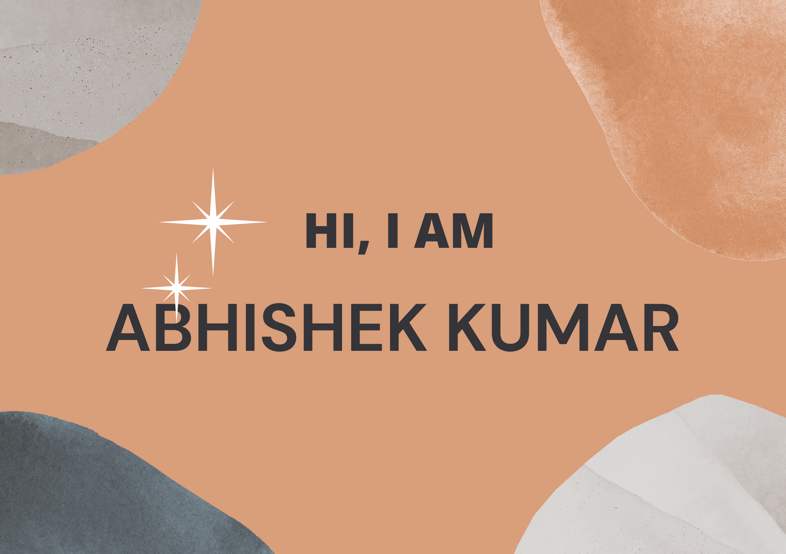

# About me
- I am an engineering student pursuing B. Tech in computer science from Indian Institute of Technology, Guwahati. I am very passionate about learning new technologies. 
- I am a Web devloper and Competitive programmer

# My statisics

# Languages familaiar to me 
1. C
2. C++
3. Javascript
4. Python
5. Java
6. C#
7. Bash
8. Typescript

# My Coding practice websites 
1. Leetcode
2. Coding Ninjas
3. GeeksForgeeks

# Frontend technologies familaiar to me
1. HTML
2. CSS
3. Javascript
4. React
5. Material UI
6. Styled-Components
7. Google Firebase

# Backend technologies familaiar to me
1. NodeJs
2. Express
3. MongoDB
4. SQL
5. Postman
6. Django
7. Mongoose

# Libraries familiar to me in Machine learning
1. Numpy
2. Pandas
3. Scipy
4. Scikit-learn
5. Matplotlib
6. Seaborn

# Other devlopement tools
## Operating system
1. Windows
2. Linux 

## Code Editor
1. VS Code

# Others
1. Unity
2. Graphviz
